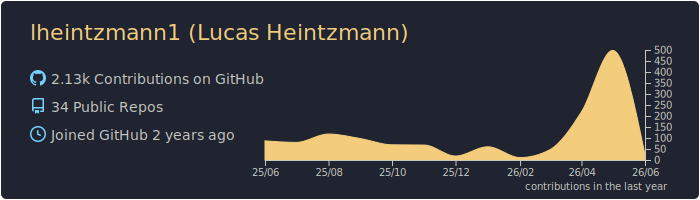
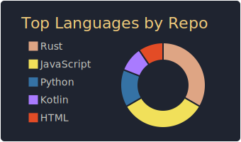
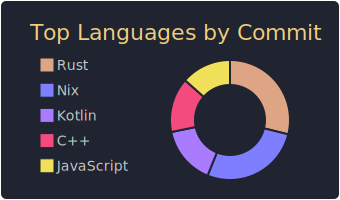
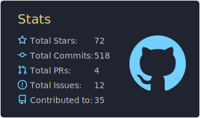
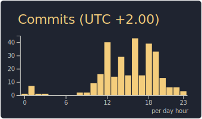

# Lucas Heintzmann

> CS student · Engine programmer · Low-level tinkerer

I'm a Computer Science student based in France, focused on **engine development, low-level systems, and graphics programming**. I enjoy working deep in the stack — from hardware-close embedded work to renderer architecture — and I like building things that other tools can't do (or won't let me do).

---

## 🔧 Apogee *(private — WIP)*

A heavily modified fork of Godot, redesigned from the ground up for high-performance, moddable game development.

**Already done:**
- Integrated **Steamworks** & **SteamAudio**
- Full engine rebrand & namespace renames

**In progress / planned:**
- 🎮 **C# only** — GDScript completely removed
- 🖼 **Pure HLSL** shaders — Godot shader language removed
- ⚙️ **ECS** architecture
- 🏎 **Jolt Physics** only — Godot's built-in physics removed
- 🔄 **120 Hz physics / simulation** step
- 🧩 **Lua modding** — player-moddable games out of the box
- 📦 Better asset packing & encryption
- 🚀 **NativeAOT** export (instead of Mono)
- 🌊 **Texture streaming** & **mesh streaming** (Nanite-like virtualized geometry)

---

## Technologies

### Languages

### Frameworks & Runtimes

### Game & Engine Development

### CAD & 3D

### Creative Tools

### Tools & Environments

---

## Stats

---

## Links

