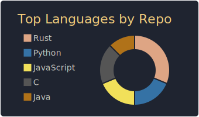
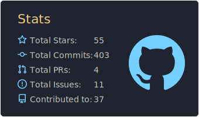
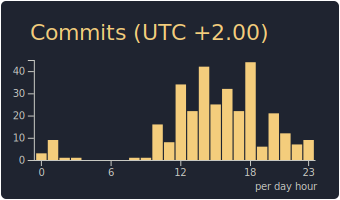

# Hey, I'm Lucas! 👋

## About Me
I'm a first-year Computer Science student in France, passionate about programming, hardware engineering, and emerging technologies. My curiosity drives me to explore areas like computer architecture, embedded systems, and low-level programming. I enjoy working on ambitious projects that blend software and hardware, and I’m always eager to learn new things! When I'm not coding, you’ll likely find me gaming.

## Technologies

### Languages

### Frameworks & Runtimes

### Game Development

### CAD & 3D Modeling

### Creative Tools
 <!-- TODO: Affinity suite -->

### Cloud & Deployment

### Tools & Environments

## Stats

While I believe hard work matters more than numbers, here are some GitHub stats for those who enjoy them.

## Connect With Me

